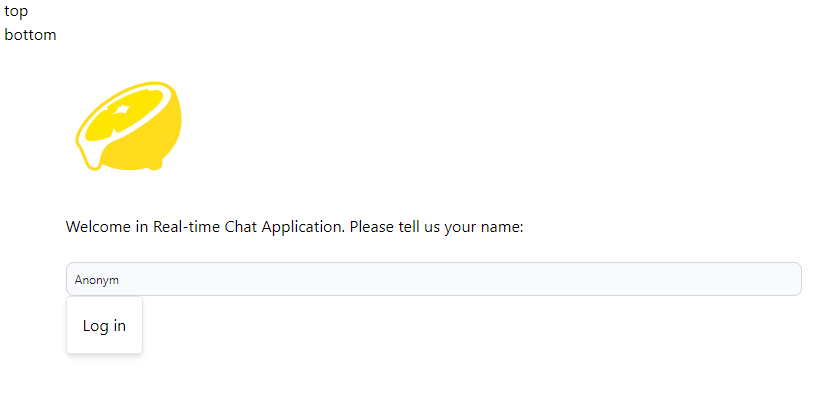

# Small Doc about application
The application is divided into three parts:

1. Nickname input field.
2. Honeypot for protection against robots.
3. Chat application for entering data.

Navigation on the top is not realized.

## Nickname.
  \
Any characters are allowed for a nickname. I don't like this solution.  \
Here should be added validation.  \
By default user has name Anonym.  \
Many the same name are allowed.

## Honeypot.
 \
To go to chat should be "onClick" even generated.  \
This can help to protect agains not smart chat-bots.

## Chat application.
  \
Any message allowed,   \
don't exists any validation,  \ 
message will be sended by press "ENTER"